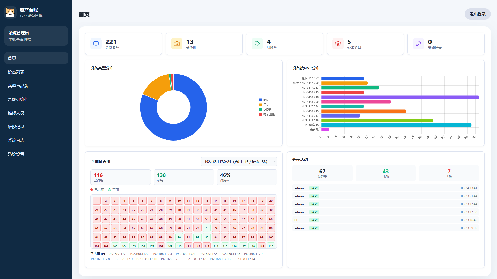
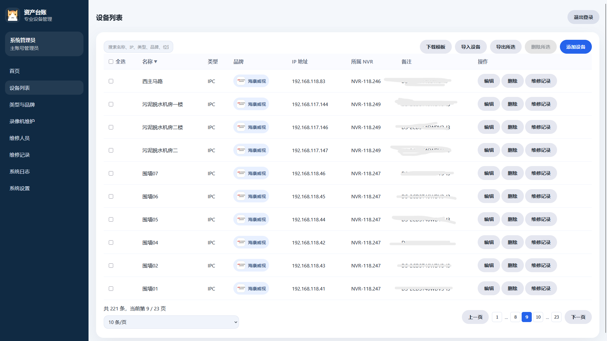

# IT Ledger

一个基于 `Node.js + Express + SQLite` 的轻量级 IT 资产台账系统，适合中小团队登记和维护监控设备、NVR、品牌类型、维修记录以及账号权限。

项目当前为前后端一体结构：

- 后端入口：`server.js`
- 前端页面：`public/index.html`
- 前端逻辑：`public/app.js`
- 本地数据：`data/data.db`

## 项目特性

- 设备台账管理：新增、编辑、删除、检索、分页、排序、批量删除
- 品牌与类型管理：维护设备类型和品牌，并支持 Logo 展示
- NVR 管理：维护录像机基础信息并建立设备归属关系
- 维修记录管理：支持单设备或多设备维修记录
- 用户与权限管理：主账号、子账号、登录开关、细粒度权限控制
- 登录日志：记录登录成功/失败时间和 IP
- 首页看板：设备数量统计、类型分布、NVR 分布、登录活动、IP 地址占用情况
- CSV 导入导出：支持下载模板、导入设备、导出选中设备
- 系统设置：站点 Logo、登录背景、文件大小限制、日志保留天数
- 文件上传：支持头像、Logo、登录背景上传
- Docker 部署：提供 `Dockerfile` 和 `docker-compose.yml`

## 适用场景

- 企业内部 IT 设备台账登记
- 安防监控设备与 NVR 关系管理
- 运维团队维修过程留痕
- 小团队局域网设备地址占用盘点

## 技术栈

### 后端

- `express`
- `sqlite3`
- `bcrypt`
- `multer`
- `cors`
- `iconv-lite`

### 前端

- 原生 `HTML / CSS / JavaScript`
- `Chart.js`

### 数据存储

- `SQLite`

不依赖独立数据库服务，启动后即可使用。

## 功能说明

### 1. 首页看板

首页提供以下信息：

- 总设备数
- NVR 数量
- 品牌数量
- 设备类型数量
- 维修记录数量
- 设备类型分布图
- 按 NVR 的设备分布图
- 按 `/24` 网段聚合的 IP 占用视图
- 最近登录活动统计

### 2. 设备管理

设备字段包含：

- 设备名称
- 设备类型
- 品牌
- IP 地址
- 安装位置
- 所属 NVR
- 备注

支持能力：

- 关键字搜索
- 分页切换
- 表头排序
- 批量勾选
- 批量删除
- 导出选中设备
- 下载 CSV 模板
- 通过 CSV 批量导入

### 3. 类型与品牌管理

可分别维护：

- 设备类型
- 品牌

支持为类型和品牌配置 Logo，用于列表展示和视觉区分。

### 4. NVR 管理

NVR 字段包含：

- 名称
- IP 地址
- 品牌
- 安装位置
- 存储容量
- 备注

设备可关联到 NVR，用于首页统计和资产归属整理。

### 5. 用户与权限

系统默认会初始化一个管理员账号：

- 用户名：`admin`
- 密码：`admin`

管理员可创建子账号，并配置：

- 显示名称
- 头像
- 是否为管理员
- 是否允许登录
- 功能权限

当前权限项包括：

- `view_devices`
- `manage_devices`
- `view_types`
- `manage_types`
- `view_nvrs`
- `manage_nvrs`
- `view_records`
- `manage_records`
- `manage_users`
- `import_devices`
- `export_devices`

### 6. 维修记录

维修记录支持：

- 选择单个设备
- 选择多个设备
- 指定维修人员
- 填写维修时间
- 填写维修内容
- 添加备注

适合记录批量巡检、集中维修、故障处理等场景。

### 7. 系统设置

管理员可在系统设置中维护：

- 站点 Logo
- 登录页背景图
- 上传文件大小限制
- 日志保留天数
- 数据库备份导出

## 目录结构

```text
it-ledger/
├─ backups/                 # 备份目录（当前项目预留）
├─ data/
│  └─ data.db               # SQLite 数据库
├─ public/
│  ├─ app.js                # 前端业务逻辑
│  ├─ index.html            # 页面入口
│  ├─ styles.css            # 样式文件
│  ├─ default-logo.svg      # 默认 Logo
│  └─ uploads/              # 已上传的静态资源
├─ uploads/                 # multer 临时上传目录
├─ Dockerfile
├─ docker-compose.yml
├─ package.json
└─ server.js
```

## 环境要求

- Node.js 16 及以上
- npm 8 及以上

项目中的 Docker 镜像基于 `Node 18`，本地也建议使用较新的 Node 版本。

## 本地运行

### 1. 安装依赖

```bash
npm install
```

### 2. 启动项目

```bash
npm start
```

### 3. 访问系统

打开浏览器访问：

```text
http://localhost:3000
```

### 4. 默认账号

```text
用户名：admin
密码：admin
```

## Docker 部署

### 方式一：使用 docker compose

```bash
docker compose up -d
```

启动后访问：

```text
http://localhost:3000
```

### 常用命令

```bash
docker compose up -d
docker compose logs -f
docker compose restart
docker compose down
```

### 当前 compose 配置说明

仓库中的 `docker-compose.yml` 已包含：

- 容器名：`it-ledger`
- 端口映射：`3000:3000`
- 环境变量：`PORT=3000`
- 数据目录挂载：`./data:/app/data`

说明：

- 数据库 `data/data.db` 会被持久化
- 当前 `docker-compose.yml` 中对 `uploads` 和 `backups` 的注释/挂载写法不够完整，如果你后续需要完整持久化上传文件，建议补充映射

可参考：

```yaml
services:
  app:
    build: .
    container_name: it-ledger
    ports:
      - "3000:3000"
    volumes:
      - ./data:/app/data
      - ./public/uploads:/app/public/uploads
      - ./uploads:/app/uploads
```

### 方式二：使用 Dockerfile

```bash
docker build -t it-ledger .
docker run -d -p 3000:3000 --name it-ledger it-ledger
```

## 生产环境部署建议

### 直接运行

```bash
npm install --production
npm start
```

### 使用 PM2

```bash
npm install -g pm2
pm2 start server.js --name it-ledger
pm2 save
pm2 startup
```

### 使用反向代理

如需通过域名访问，建议在 `Nginx` 或网关后转发到 `3000` 端口。

Nginx 示例：

```nginx
server {
    listen 80;
    server_name your-domain.com;

    location / {
        proxy_pass http://127.0.0.1:3000;
        proxy_http_version 1.1;
        proxy_set_header Upgrade $http_upgrade;
        proxy_set_header Connection "upgrade";
        proxy_set_header Host $host;
        proxy_cache_bypass $http_upgrade;
    }
}
```

## 数据与文件说明

### 数据库位置

程序实际使用的数据库文件是：

```text
data/data.db
```

`server.js` 中会在启动时自动创建 `data` 目录和相关表结构。

### 上传文件位置

前端实际访问的图片资源保存在：

```text
public/uploads/
```

上传流程中间会先写入：

```text
uploads/
```

再复制到 `public/uploads/` 供页面访问。

### 备份

系统设置页支持导出数据库备份，备份内容本质上是当前 SQLite 数据文件。

手工备份也可以直接复制：

```bash
cp data/data.db data/data-backup.db
```

Windows PowerShell 示例：

```powershell
Copy-Item .\data\data.db .\data\data-backup.db
```

### 恢复说明

如果你采用手工恢复，建议先停止服务，再用备份文件覆盖 `data/data.db` 后重新启动。

## CSV 导入说明

设备导入使用 CSV 文件，表头建议与系统模板一致。

模板字段：

- `设备名称`
- `设备类型`
- `品牌`
- `IP地址`
- `安装位置`
- `所属NVR`
- `备注`

注意事项：

- 设备类型必须已存在
- 品牌如果填写，则必须已存在
- 所属 NVR 如果填写，则必须已存在
- 若有任一行导入失败，系统会回滚整个事务，不会只导入部分数据
- 导入逻辑兼容 `utf8`、`gbk`、`gb18030`、`utf16le` 等常见编码

## 接口概览

系统主要接口包括：

- `/api/login`
- `/api/verify`
- `/api/users`
- `/api/login-logs`
- `/api/device-types`
- `/api/brands`
- `/api/nvrs`
- `/api/devices`
- `/api/devices/batch-delete`
- `/api/maintenance-records`
- `/api/settings`
- `/api/backup`
- `/api/restore`
- `/api/import-devices`
- `/api/export-devices`
- `/api/template/devices`
- `/api/upload-avatar`
- `/api/upload-background`
- `/api/upload-logo`

认证方式为请求头：

```text
x-access-token: <token>
```

## 已知实现细节

- 认证令牌当前保存在服务进程内存中，服务重启后需要重新登录
- 数据库为单文件 SQLite，适合轻量场景，不适合高并发多实例写入
- 登录页背景图为全局设置，同时会写入管理员账号资料
- 登录日志接口和系统设置仅主账号可见

## 后续可优化方向

- 增加环境变量配置文件
- 增加自动化测试
- 增加接口文档
- 完善 Docker 卷挂载
- 增加数据库恢复页面入口
- 增加密码修改、退出全部会话、操作审计等安全能力

## License

本仓库为公开展示仓库，不属于开源授权项目。

- All Rights Reserved
- 未经作者事先书面许可，任何人不得复制、修改、分发、再发布或用于商业用途
- 公开可见不代表授予开源使用权

如需商用、二次开发、分发或其他授权，请联系作者获取书面许可。




